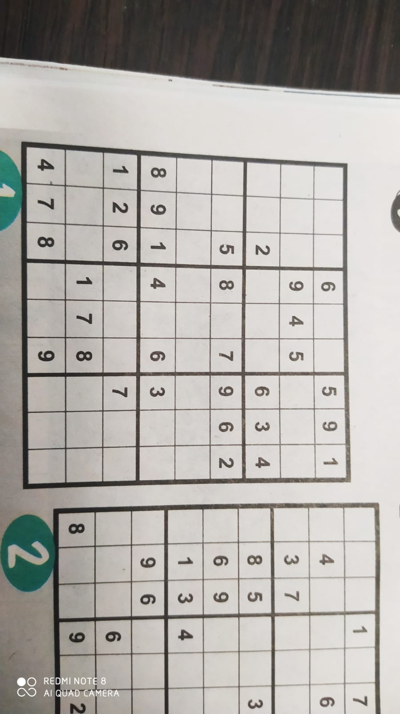

# Image and number recognition Sudoku puzzle solving
Solving sudokus started to become a bit boring, so i decided to have some fun and do it with a different approach: Taking a picture of the Sudoku puzzle from newspapers and solving it with help of OpenCV, ConvNets, Python and the backtracking algorithm.

## How to run:
First, to make sure you have all of required modules installed, get them from supplied *requirements.txt* using the following command:
```bash
$ pip install -r requirements.txt
```
After that, simply run with ``` $ python solve_sudoku.py``` and watch it solve Sudoku puzzle that's on the image '**sudoku.jpg**'. <br>
An sample image is already provided, so to try it out with a different picture, replace the old picture with a new one thats has the same name - '*sudoku.jpg*', and use my pretrained model to try and recognize the numbers.

## How it works - short explanation 
### Before starting
Sudoku contains of 9 **boxes** each containing 3x3 **squares**. All of them combine a single **grid**, containing 81 squares in total.<br>
For more explanation on the game and its rules, see [Wikipedia](https://en.wikipedia.org/wiki/Sudoku).<br>

### Processing the image
First, we need to take image that has the Sudoku puzzle on it - like this one: <br/><br/> 

<br/>

<p>After that, <i>split_squares.py</i> comes to play, with OpenCV. </p>
In order for it to be recognized, the Sudoku puzzle must be in the foreground, however it's not necessary for it to be the only thing on the picture.
When the Sudoku grid is recognized, using quite some OpenCV processing, it will be split into 81 images of 28x28 shape and saved to **square_images** folder like this:

    <br>
In order to visualize the processing more easily, I decided to save them, although they could be worked on directly from the code, without the need of saving them.

### Recognizing numbers
The job of *recoqnize_numbers.py* module. <br>
In order to recognize numbers, new dataset with synthetic font numbers neded to be created for the model to be trained on, because the MNIST handwritten digit dataset wasn't appropriate enough, as the numbers here are printed in newspapers.
Each image needs to be processed with OpenCV to determine if its empty or not. After that, the ones that contain a number will be passed to the model to be recognized.

### Solution
The sudoku puzzle, now represented as an array, is solved using the Backtracking algorithm and printed like this:
  
